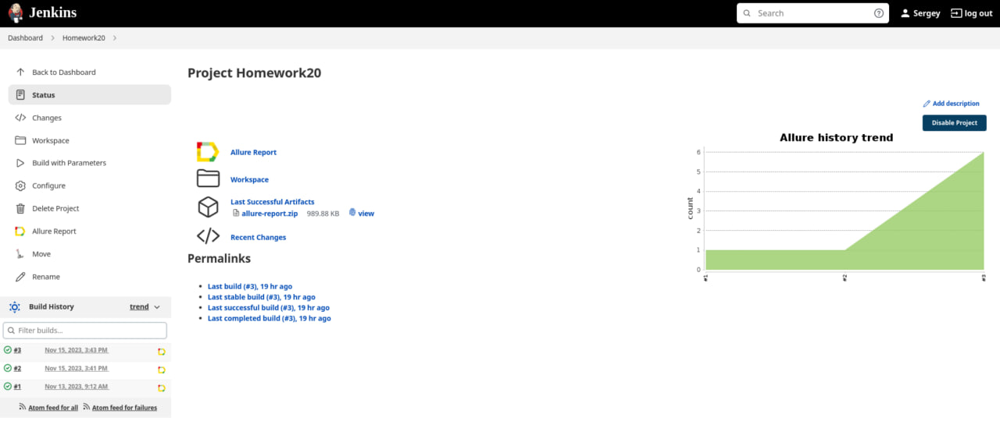
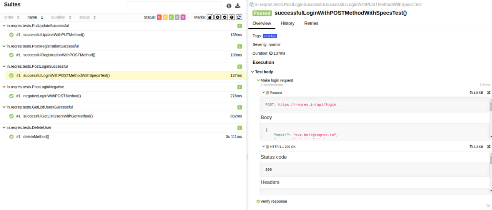
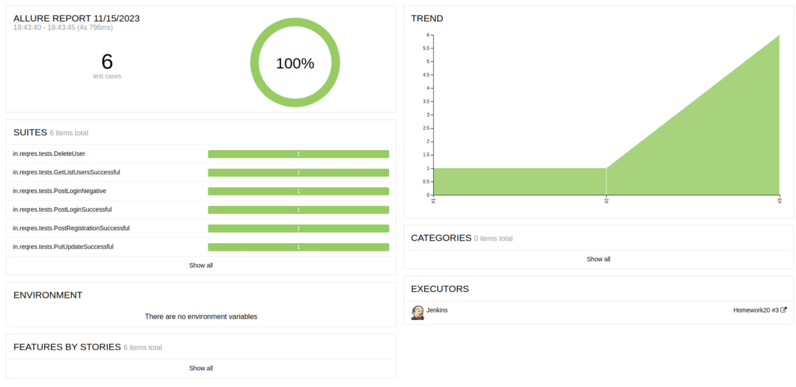
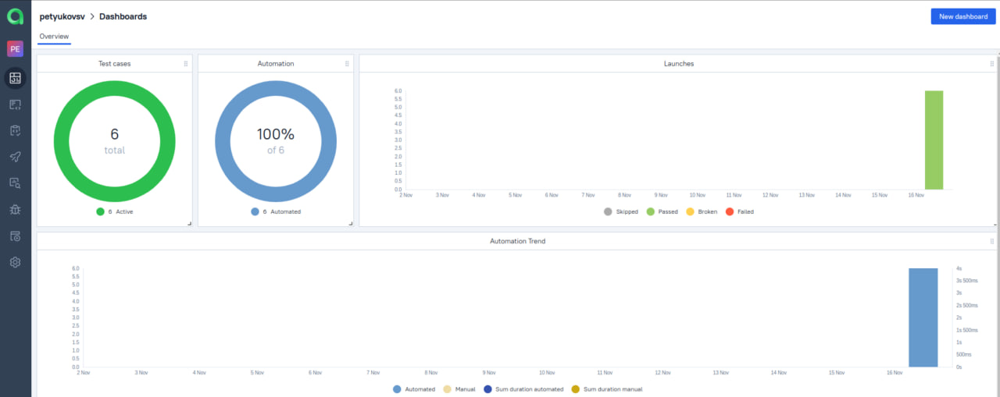
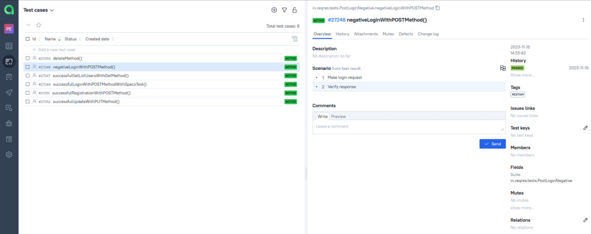
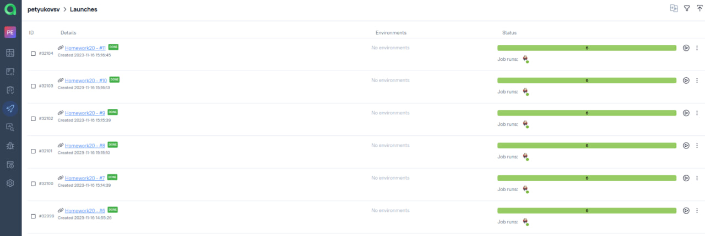
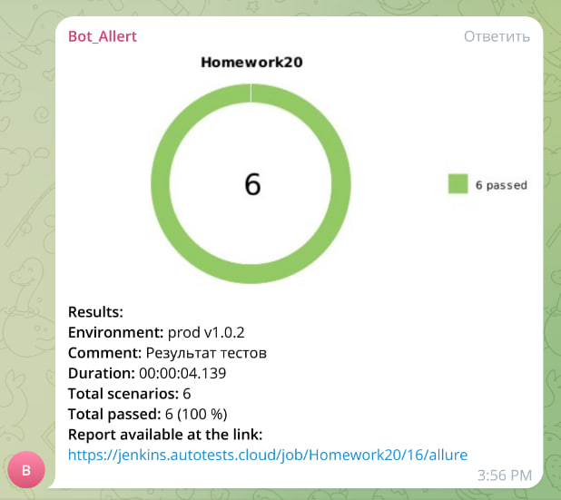

<h1 >Проект по автоматизации тестирования API сервиса <a href="https://reqres.in/"> Reqres</a></h1>
<a href="https://reqres.in/"></a>

##  💻 Что я использую

<p align="center">
<a href="https://www.jetbrains.com/idea/"></a>
<a href="https://www.java.com/"></a>
<a href="https://github.com/"></a>
<a href="https://junit.org/junit5/"></a>
<a href="https://gradle.org/"></a>
<a href="https://github.com/allure-framework/allure2"></a>
<a href="https://https://qameta.io/"></a>
<a href="https://www.jenkins.io/"></a>
<a href="https://https://telegram.org/"></a>
</p>

---
## Содержание проекта

- <a href="#check"> Реализованные проверки</a>
- <a href="#buildJenkins"> Cборка в Jenkins</a>
- <a href="#exampleReport"> Пример отчета прохождения автотеста</a>
- <a href="#allureReport"> Пример Allure отчета</a>
- <a href="#integrationAllureTO"> Интеграция с Allure TestOps</a>
- <a href="#telegramReport"> Уведомления в телеграм с использованием бота</a>
- [Уведомления в телеграм с использованием бота](#Telegram-Уведомления-в-телеграм-с-использованием-бота)

--- 

<a id="check"></a>
## Реализованные проверки

- ✓ Регистрация пользователя
- - Проверка негативного сценария регистрации
- ✓ Проверка данных пользователя в общем списке пользователей
- ✓ Обновление данных пользователя
- ✓ Удаление пользователя

--- 

<a id="buildJenkins"></a>
## </a> Сборка [Jenkins](https://jenkins.autotests.cloud/job/Homework20")
<p align="center">
<a href="https://jenkins.autotests.cloud/job/Homework20/"></a>
</p>
После выполнения сборки, в блоке <code>История сборок</code> напротив номера сборки появятся 
значки <code>Allure Report</code> и <code>Allure TestOps</code>, при клике на которые откроется страница 
с сформированным html-отчетом и тестовой документацией соответственно.

--- 

<a id="exampleReport"></a>
## 🤖 Пример отчета прохождения автотеста
<p align="center">

</p>

--- 

##  Запуск тестов из терминала
Команда запуска тестов:
```
gradle clean test
```
<a id="allureReport"></a>
##  </a> Пример [Allure-отчета](https://jenkins.autotests.cloud/job/Homework20/3/allure/) 
## ⛅: Основной отчет
<p align="center">

</p>

--- 

<a id="integrationAllureTO"></a>
## </a> Интеграция с  [Allure testOps](ttps://allure.autotests.cloud/project/3795/dashboards)

## Доска
На *Dashboard* в <code>Allure TestOps</code> видна статистика количества тестов. Новые тесты, а так же результаты прогона приходят по интеграции при каждом запуске сборки.

<p align="center">

</p>

--- 

##  Пример тест-кейса
<p align="center">

</p>

--- 

## 🏃 Запуски
<p align="center">

</p>

--- 

<a id="telegramReport"></a>
## </a> Уведомления в телеграм с использованием бота
После завершения сборки специальный бот, созданный в <code>Telegram</code>, автоматически обрабатывает и отправляет сообщение с отчетом пройденых тестов.

<p align="center">

</p>
